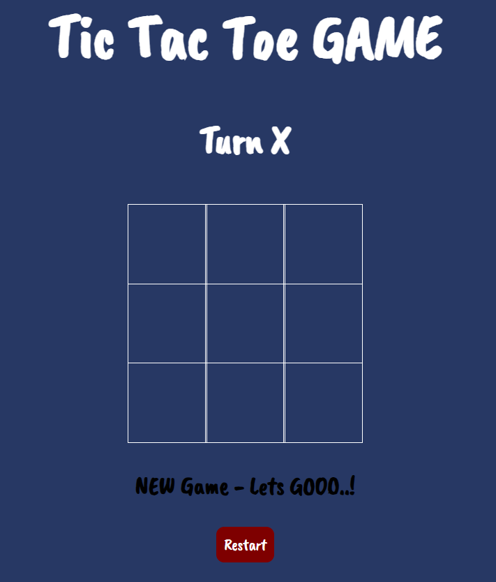
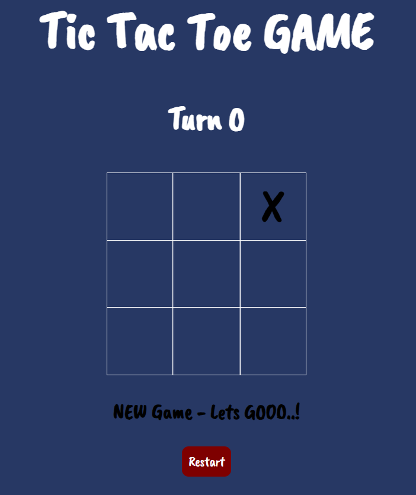
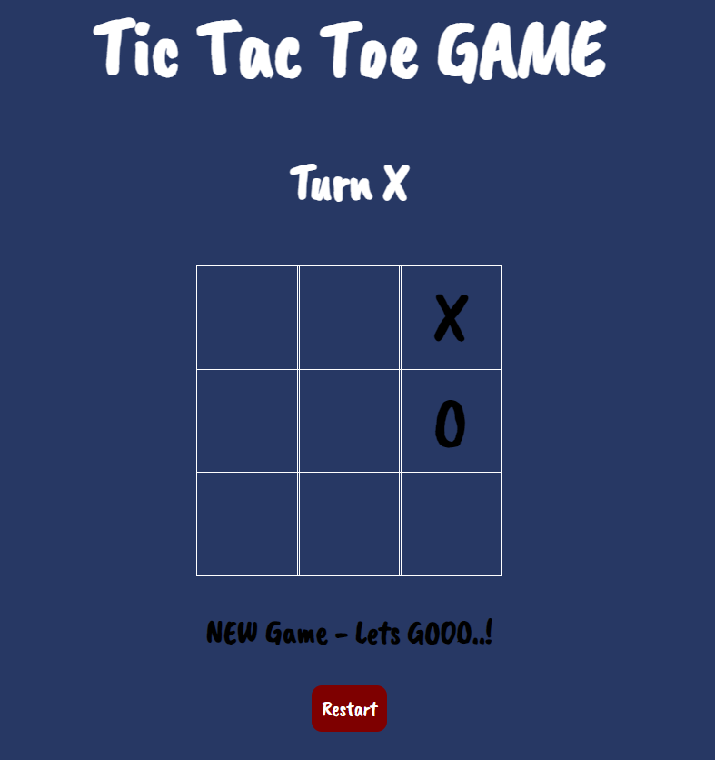
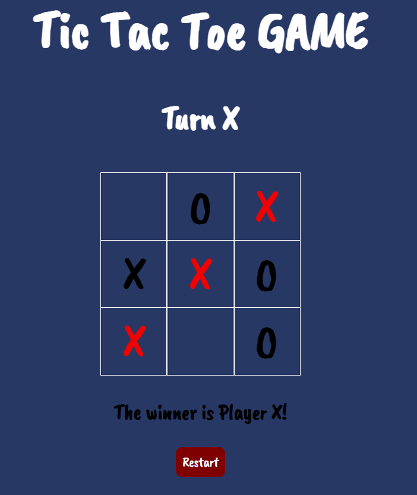

# tic-tac-toe

The game board is empty, ready to start a new game.
It's player X's turn

Player X has chosen a slot and now it is player O's turn

Player O has chosen a slot and now it is player X's turn

Game Over - Player X's is the winner!
for restart press restart

